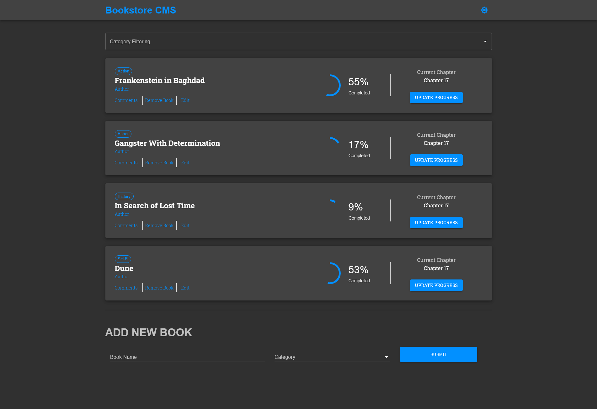
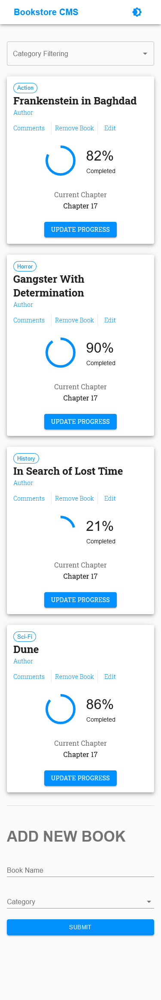

# Book Store

> A react application that lets you create a new book or delete a specific book using Redux. 
Styled via Material UI. Dark and light themes were implemented and localStorage was used to save the preferred theme of the user.

## Live Demo

[Live Demo Link](https://mbooks-store.netlify.app/) 

Desktop screenshot
 

Mobile screenshot
 

## Built With

- ReactJS
- Redux
- Material UI

## Authors

👤 **Martin Najjar**

- Github: [Martin Najjar](https://github.com/martinnajjar12)
- Twitter: [Martin Najjar](https://twitter.com/martin_najjar)
- Linkedin: [Martin Najjar](https://www.linkedin.com/in/martinnajjar12/)

## 🤝 Contributing

Contributions, issues and feature requests are welcome!

Feel free to check the [issues page](https://github.com/martinnajjar12/book-store/issues).

## Show your support

Give a ⭐️ if you like this project!

## Acknowledgments

- [Microverse](https://microverse.org)

## 📝 License

This project is [MIT](https://github.com/martinnajjar12/book-store/blob/development/LICENSE) licensed.
